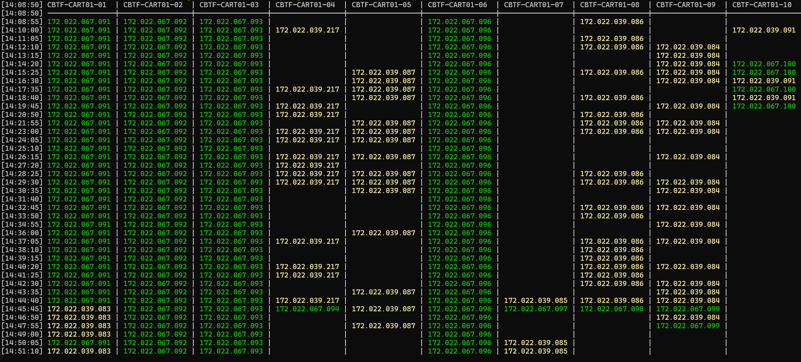

# Summary
Script to monitor changes in the IPs of a set of AD DNS records over time.  

As an example of the purpose, the original use case was to monitor the IPs returned by the AD DNS records for a cart of laptops, to see when and how often they would switch between wired and wireless. The data gathered was useful in optimizing device power management and network adapter priority.  

# Requirements
- PowerShell 7+ for the use of `ForEach-Object -Parallel` within the `Ping-All` module.
- [Ping-All](https://github.com/engrit-illinois/Ping-All) module

# Behavior
This script pings a set of AD computer names a given number of times with a given interval in between (e.g. once a minute for 24 hours), and outputs the resulting IPv4 IPs to the console and to a CSV file.  

The script accepts information about one or more IP ranges, and will color code the console output depending on which range a given IP falls in. This is just to make it easier to see changes over time at a glance without actually reading each IP. If desired, the raw CSV output can be similarly and easily color coded in Excel using conditional formatting.  

Note that IP ranges are accepted and output with leading zeros for padding, such that all IPs are always displayed with the same 15-character width.  

# Usage
1. Download `Test-AdDnsOverTime.psm1` to the appropriate subdirectory of your PowerShell [modules directory](https://github.com/engrit-illinois/how-to-install-a-custom-powershell-module).
2. Download [Ping-All](https://github.com/engrit-illinois/Ping-All) to the appropriate subdirectory of your PowerShell [modules directory](https://github.com/engrit-illinois/how-to-install-a-custom-powershell-module).
3. Run `Test-AdDnsOverTime` using the documentation below.

# Example
```powershell
$comps = Get-ADComputer -Filter "name -like 'lt-cart01-*'" | Sort "Name" | Select -ExpandProperty "Name" | Select -First 10
Test-AdDnsOverTime -Computer $comps -IpRanges -IpRanges "010.000.000.*:green:;172.016.000.*::yellow"
```



# Parameters

### -Computer [string[]]
Required string array.  
An array of strings representing the AD computer names to monitor.  
Note: the header of the console output won't align with the columns if the computer names are >15 characters.  

### -IpRanges [string]
Optional string.  
A specially formatted string representing one or more IP ranges and their properties.  
Each given IP range has the following properties:
- A wildcard query string against which each IP will be matched. If an IP matches this query, it will be color coded in the output based on the following 2 properties.
  - The query string should use a zero-padded format, e.g. `010.000.000.*`, or `010.000.*`, etc.  
- A foreground color.
- A background color.
The properties for each IP range are accepted in colon-delimited format. If either color is omitted, the corresponding colon should still be supplied.   
The ranges are accepted in semicolon-delimited format.  
For example, the following value of `-IpRanges` will result in all IPs matching `10.0.0.*` having a green foreground, and all IPs matching `172.16.0.*` having a yellow background: `-IpRanges "010.000.000.*:green:;172.016.000.*::yellow"`.  
Acceptable color names or integer values are defined here: https://learn.microsoft.com/en-us/dotnet/api/system.consolecolor?view=net-9.0.  

### -TestCount [int]
Optional integer.  
The number of pings to perform on each computer in total.  
Default is `1440` (i.e. the number of minutes in a day).  

### -IntervalSeconds [int]
Optional integer.  
The number of seconds to wait between each ping operation.  
Default is `60`.  
Note that this delay happens after the completion of the previous set of ping operations, so values of `-TestCount 1440 -IntervalSeconds 60` will take more than 24 hours to complete.  
You may wish to account how long a given set of pings will take, so that you don't end up starting a new set of pings before the previous set is finished. The `-PingCount` and `-PingTimeoutSeconds` parameters can help with that.  
The `Ping-All` module pings systems in parallel, so ideally, each set of pings should take much longer than the longest response time from any given system (i.e. ~ `-PingTimeoutSeconds`).  
### -PingCount [int]
Optional integer.  
The number of individual ping tests to each individual computer for each loop.  
Normally, ping operations perform 4 tests per ping operation. For the purposes of this script, `1` or `2` is generally sufficient.  
Default is `2`.  

### -PingTimeoutSeconds [int]
Optional integer.  
The number of seconds to wait for each individual ping test to a given computer for a given loop, before timing it out and moving on to the next test.  
Default is `2`.  

### -IpUnknownRangeFc [string]
Optional string.  
If specified, the foreground color to apply to IPs printed to the console if they match none of the queries supplied by `-IpRanges`.  
Has no effect if `-IpRanges` is not specified.  

### -IpUnknownRangeBc [string]
Optional string.  
If specified, the background color to apply to IPs printed to the console if they match none of the queries supplied by `-IpRanges`.  
Has no effect if `-IpRanges` is not specified.  

### -LogDir [string]
Optional string.  
The path to a directory where the CSV log will be created.  
The file itself will be named like `Test-AdDnsOverTime_<timestampe>.csv`.  
Default is `c:\engrit\logs`. You may wish to change this default in the script file to suit your own environment.  

# Notes
By mseng3. See my other projects here: https://github.com/mmseng/code-compendium.